# AllWhale
A WeChat mini program that combines on-campus forum, second-hand platform, and more. This project was completed in 2022.

## Story
This project was initially started by a group in Oxford CSSA, who approached me and my friend, Match, in the summer of 2022 to join them. We agreed. Together, we decided to develop a WeChat Mini Program featured in on-campus online forum and second-hand trading platform, and named it AllWhale (originally oxcean). The reason for using WeChat Mini Program was that we wanted to popularize WeChat in Oxford.

After almost half a month of preparation, we started the development stage, with Match handling the front-end and me in charge of the back-end and code review. The development process lasted for three months, during which Match and I continued to develop the program while schooling, which was a very busy but fulfilling and enjoyable period of time.

## Tech Stack
1. Java
2. Maven
3. Spring Boot
4. WebSocket
5. MySQL
6. MyBatis
7. Redis
8. JavaScript
9. uni-app (based on vue)
10. Apache Tomcat

## Deploy
### Note
1. The WeChat Mini Program Account: ```AllWhaleLYZ```
2. The server IP address: ```34.41.117.214```

### Front-end: ```WeChat Mini Program```
1. set up the server address
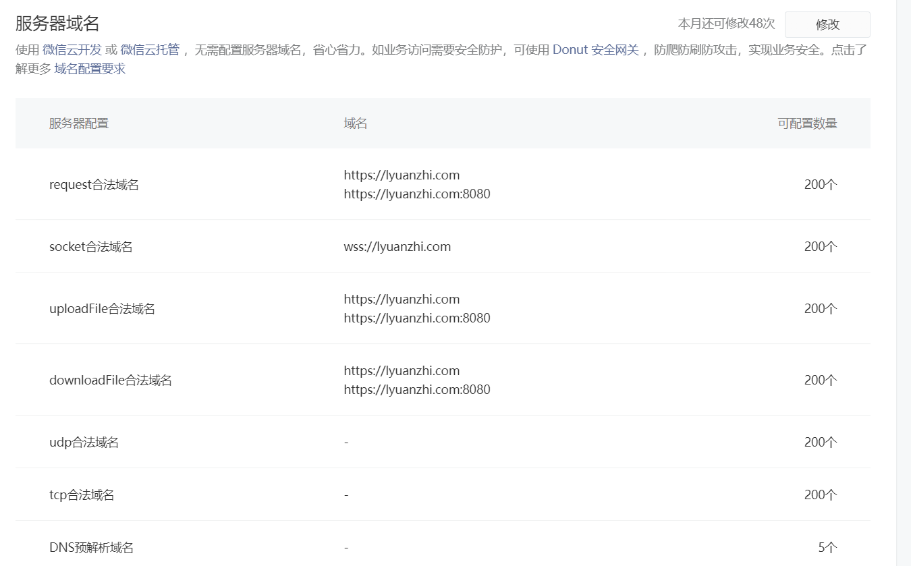
2. upload to ```WeChat Mini Program Platform```
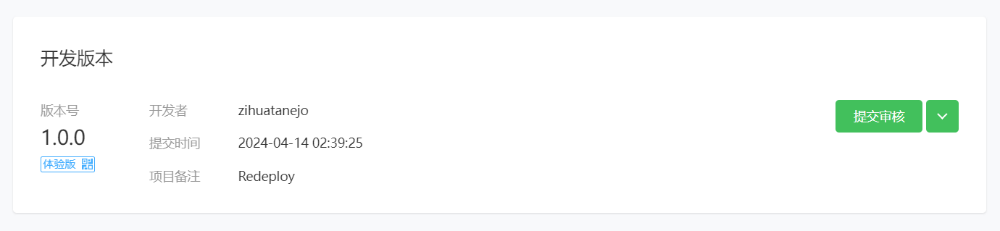
3. set to experience version
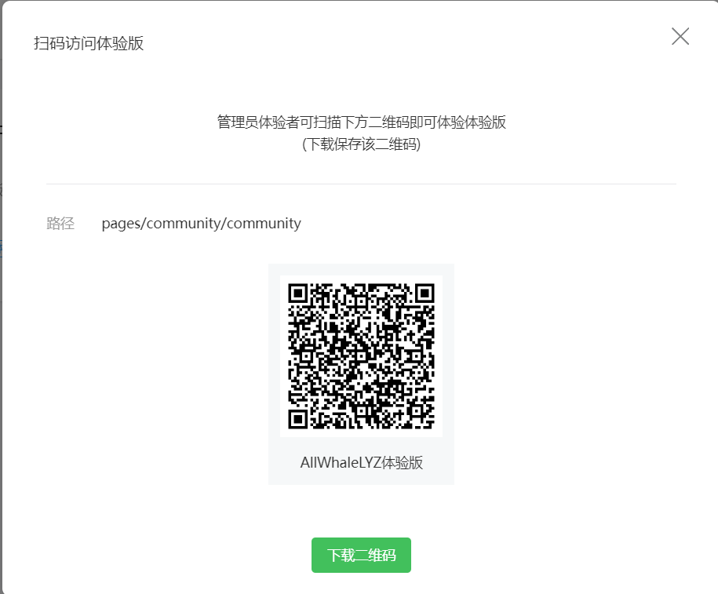
Then you can scan the QR code with WeChat to request access permission.

### Back-end: ```Google Cloud```
1. create a vm in Google Cloud
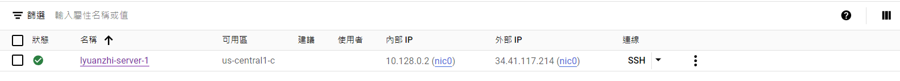
2. set up MySQL, Redis
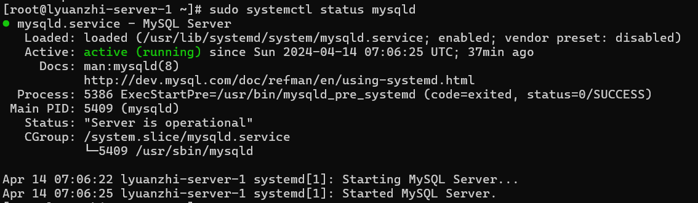
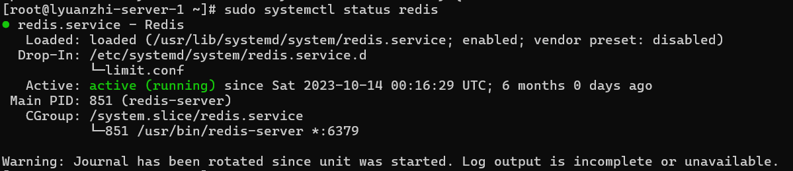
3. upload oxcean.war and run it
```nohup java -jar oxcean.war &```
4. check using ```lsof -i:8080```
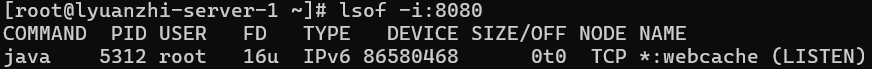

## Demo Screenshots
### Forum
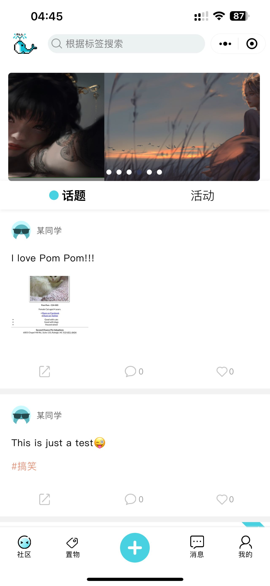
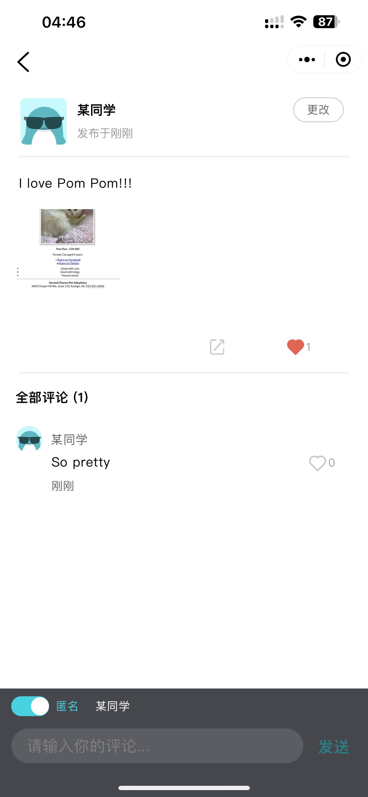
### Search
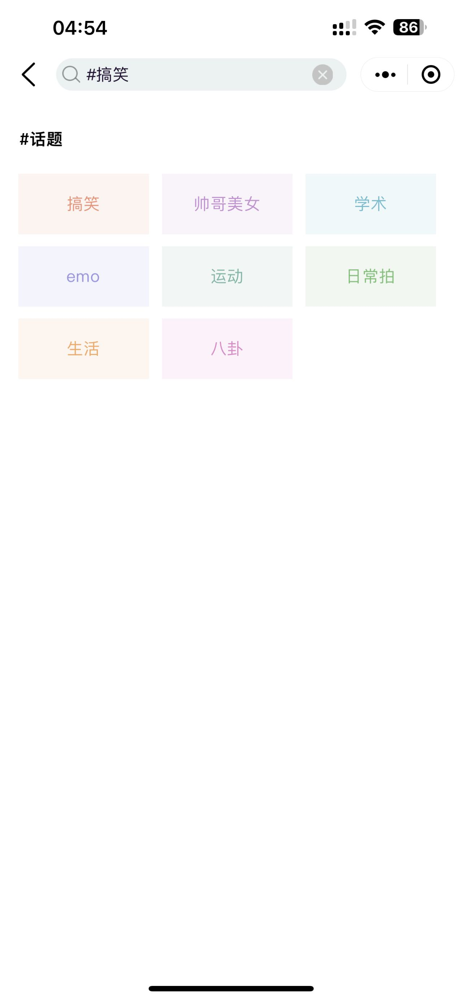
### Activities Organization
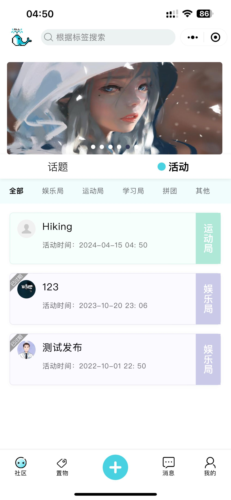
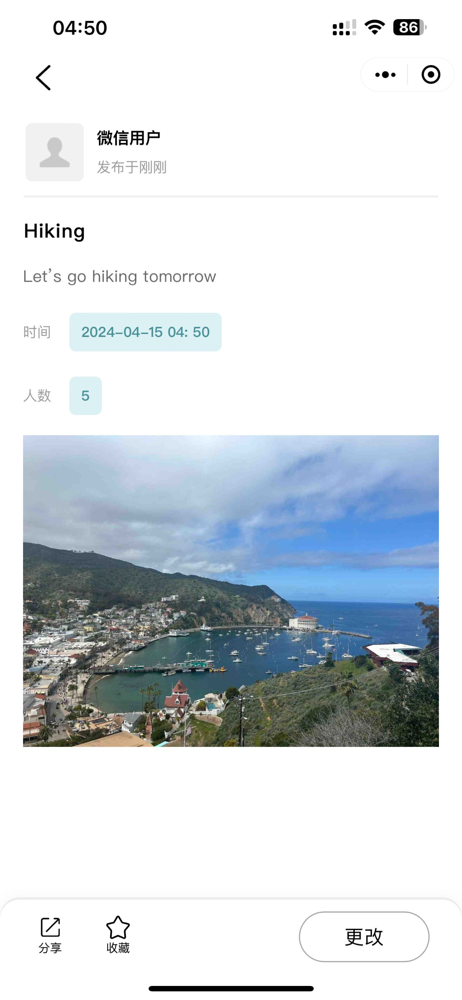
### Second-hand

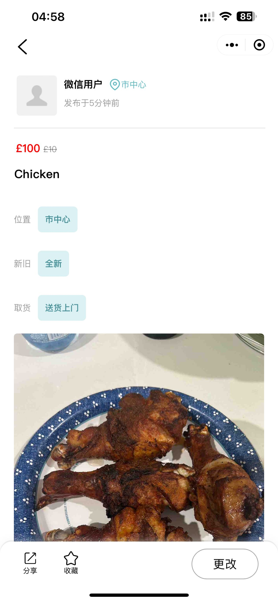
### Chat
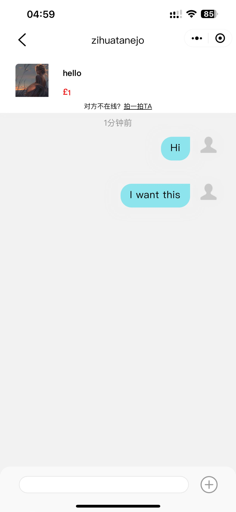
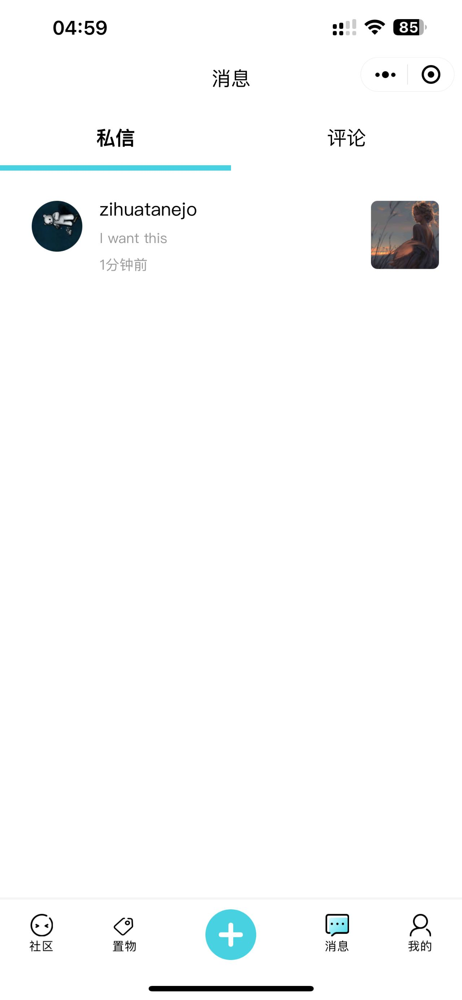
### Publish
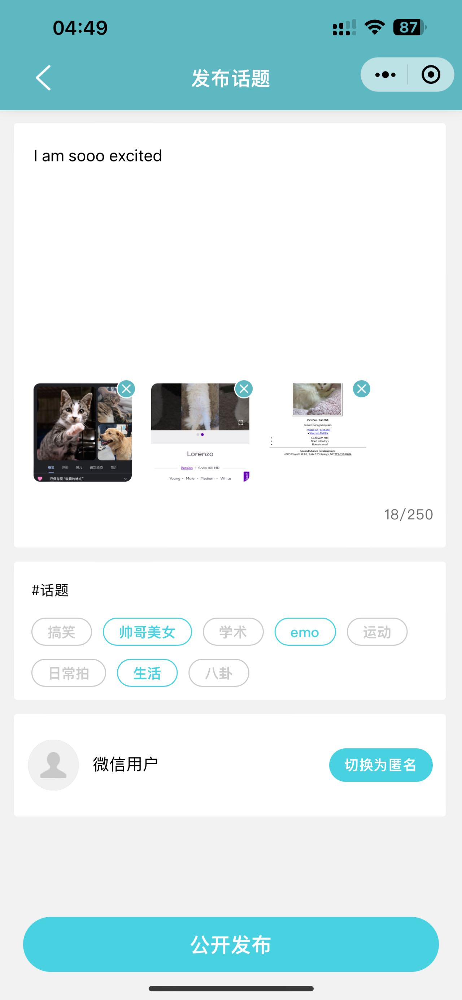
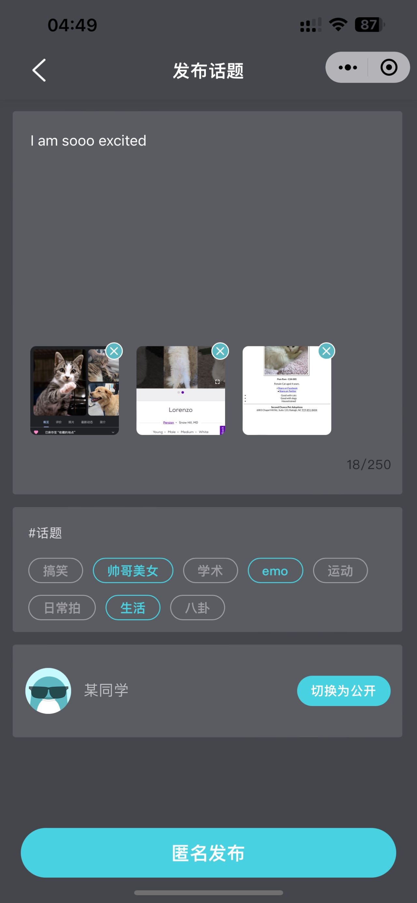
### About us
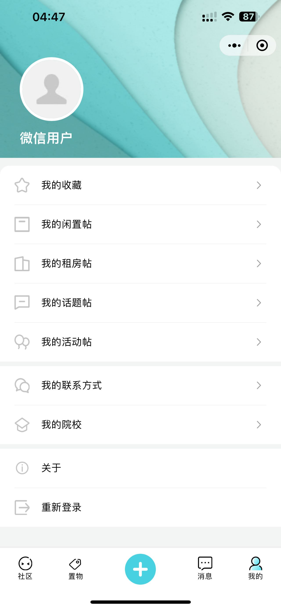
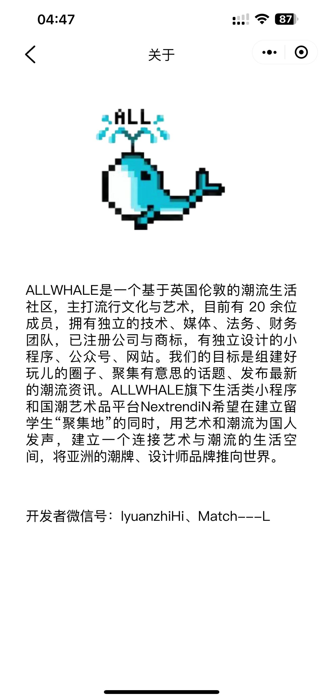
